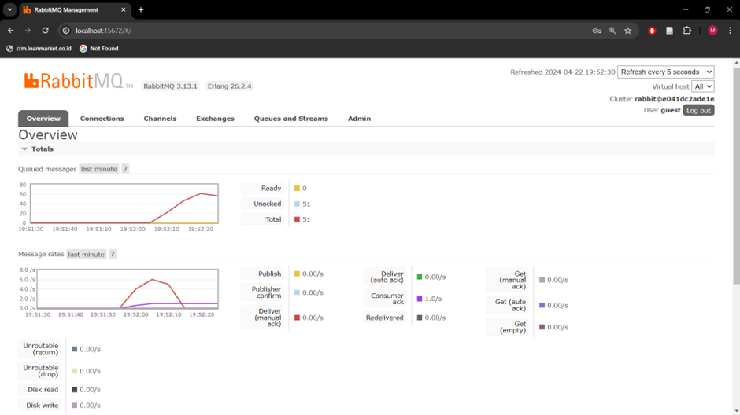
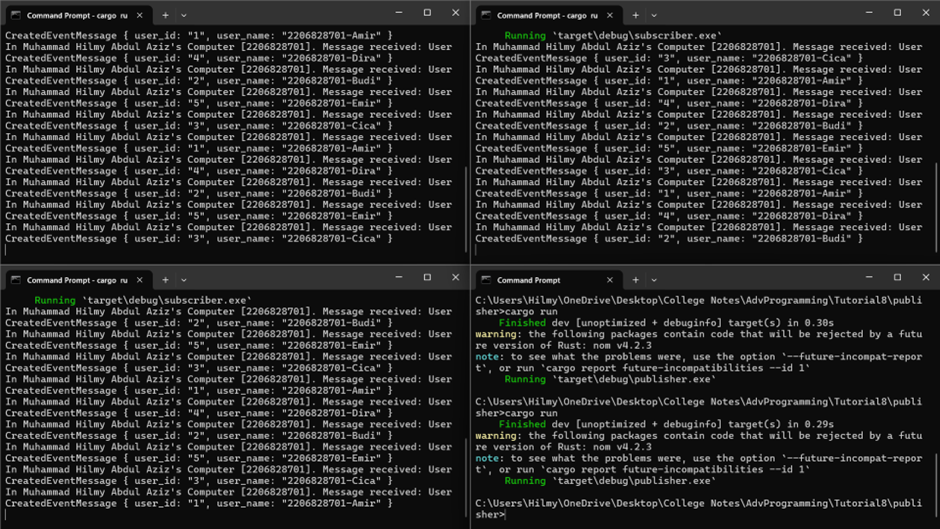
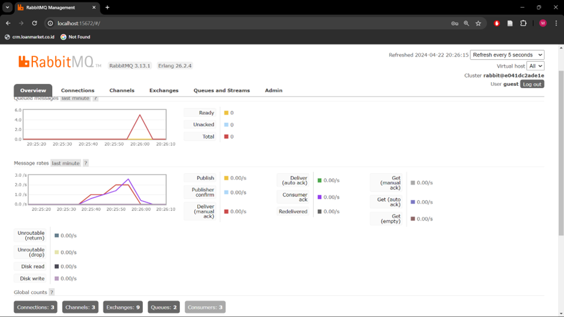

## Tutorial 8 Questions

1. what is __amqp__?
+ AMQP stands for Advanced Message Queuing Protocol. It is an open standard application layer protocol for message-oriented middleware, enabling communication between different systems in a reliable and asynchronous manner.
2. what it means? `guest:guest@localhost:5672` , what is the first quest, and what is the second __guest__, and what is __localhost:5672__ is for? 
+  `guest:guest@localhost:5672` is used for establishing a connection to the AMQP server. This string follows a specific format, where each component has each of their roles in the connection process. 
+ First, the term `guest` represents the username used for authentication when connecting to the AMQP server. 
+ Similarly, the second occurrence of guest denotes the password associated with the provided username. These credentials are essential for verifying the identity of the client attempting to connect to the server.
+ Finally, `localhost:5672` specifies the address and port of the AMQP server which is run on a local machine.
+ Put it all together `guest:guest@localhost:5672` instructs the application to connect to the AMQP server using the specified username and password via port 5672 on the local machine.

## Slow Subscriber

+ After running `cargo run` on publisher around 10 times we can see that theres a spike in queued messages, ranging around 50-70 when i ran 10 times consecutively, this indicates a bottleneck in message processing.
+ This bottleneck occurs when the subscriber experiences delays in handling incoming messages (caused by changing the subscriber code so that `subscriber delay 1 second for every process`), leading to an accumulation of messages in the queue. 
+ Regarding the total number of queues, the number may vary depending on the system configuration and workload in this case workload previously mentioned.

## Many Slow Subscriber Simulation slow subscriber
+ Running 3 subscribers

+ After running `cargo run` on publisher around 10 times there was an initial spike in queue messages that quickly subdued.
+ We can conclude with he addition of more subscribers it contributes to mitigating the buildup of pending messages within the message queue. Basically, when there are multiple subscribers in action, they operate concurrently to handle incoming messages.
+ This concurrent processing allows for a more efficient distribution of workload across the subscriber nodes.It also accelerates the overall responsiveness of the system to incoming message streams. With a higher number of subscribers actively participating in message processing, the system can better keep pace with the rate at which messages are delivered by the publisher. 